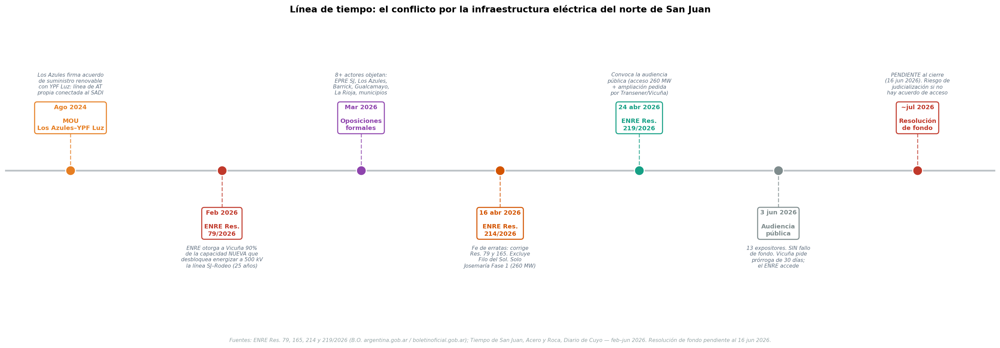
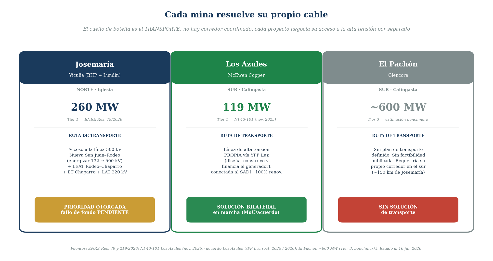
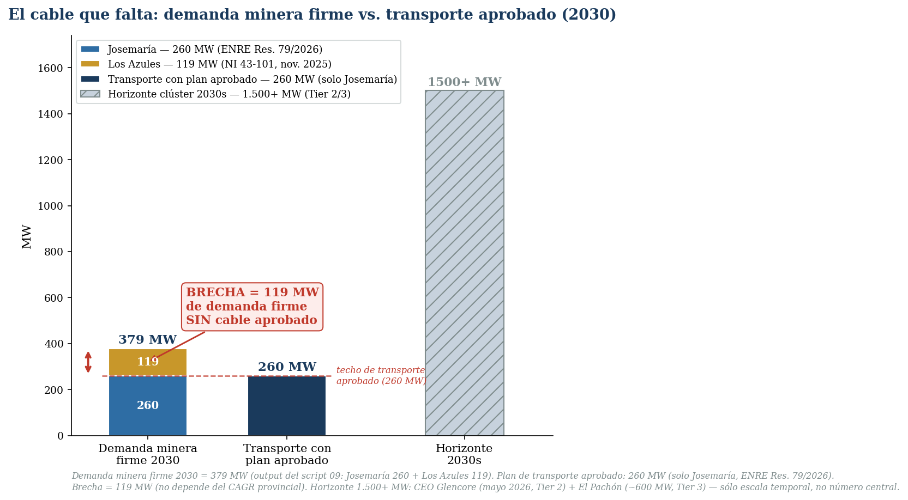
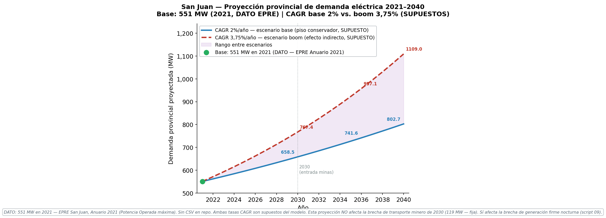

# SAN JUAN ENERGY GAP — El cable que falta
## Guía del relato — v2 (enfoque transporte)
### Por qué el boom del cobre de San Juan no es un problema de generación, sino de transmisión

> **Idea fuerza:** San Juan puede generar, y el país puede generar. Lo que no existe es el
> cable de 500 kV con capacidad para llevar esa energía, 24/7, hasta las minas de la cordillera.

**Junio 2026 — Versión 2 del relato (reordenamiento del análisis v3.1, sin rehacer los cálculos).**

---

## Nota de alcance (leer primero)

Este documento **reordena y enriquece** el análisis previo; no rehace los números. El eje cambió:
ya no preguntamos *"¿San Juan genera lo suficiente?"* sino *"¿existe el transporte de alta tensión
para llevar la demanda minera a la cordillera?"*. La mina no se abastece de la generación provincial:
se conecta al **SADI** (la red nacional) como **gran usuario**.

**Supuesto declarado como acotación de alcance —** asumimos que el SADI nacional tiene generación
suficiente para abastecer demanda nueva; **este análisis no evalúa la disponibilidad firme nacional
hora a hora**. No es un hecho probado: en 2026 el Estado lanzó **AlmaSADI** (licitación de hasta
700 MW de almacenamiento "para reserva y confiabilidad", con 100 MW asignados a Cuyo), señal de un
sistema más ajustado que holgado. Lo tomamos como límite del estudio, no como certeza.

**Regla de oro —** todo número derivado del pipeline es el output de un script reproducible
(07/08/09/10/11). Lo que no sale de un script lleva su fuente y su nivel de evidencia (Tier 1/2/3).

---

## Índice

- [0. Conceptos mínimos](#0-conceptos)
- [1. El gancho: la pelea por un solo cable](#1-gancho)
- [2. La hipótesis fácil que hay que descartar: "¿no falta generación?"](#2-descarte)
- [3. El eje: el cable que falta](#3-eje)
- [4. La prueba con datos firmes: 119 MW en 2030](#4-prueba)
- [5. Jurisdicción nacional y el ENRE: por qué se decide en Buenos Aires](#5-enre)
- [6. El espejo de Chile: cómo se resuelve cuando las reglas funcionan](#6-chile)
- [7. Qué NO prueba este análisis](#7-limites)
- [8. Cierre y qué monitorear](#8-cierre)
- [Apéndices A–E](#apendices)

---

## 0. Conceptos mínimos

Sólo tres ideas hacen falta para seguir todo el relato.

**0.1 — MW vs. MWh.** El **MW (megavatio)** es *potencia*: capacidad disponible en un instante. El
**MWh (megavatio-hora)** es *energía*: potencia × tiempo. Cuando decimos "Josemaría necesita 260 MW",
queremos decir que en cada instante necesita esa capacidad. Una mina de 260 MW continua consume
260 × 8.760 = ~2,28 TWh/año.

**0.2 — Por qué alta tensión.** La pérdida en una línea es **P = I²·R**: a mayor tensión, menor
corriente para la misma potencia, y las pérdidas caen al cuadrado. A 500 kV se pierde ~1% cada 100 km;
a 132 kV, ~3–5%. Con las minas a 250–410 km del nodo San Juan, transportar en 132 kV significaría
perder entre 10% y 20% de la energía. Por eso el cuello de botella es, literalmente, **una línea de
500 kV** (ver figura `et_diagrama`).

**0.3 — Firme vs. intermitente.** Una fuente es **firme** si produce a voluntad 24/7 (hidro con
embalse, gas). Es **intermitente** si depende del recurso natural (solar de día, eólico con viento).
**Las minas necesitan suministro firme garantizado.** El factor de capacidad solar real de San Juan
es **26,0%** (script 10) — clave para entender por qué "poner paneles" no resuelve la noche.

---

## 1. El gancho: la pelea por un solo cable

El 3 de junio de 2026, el ENRE realizó una audiencia pública por una sola pregunta: **quién puede usar
el único corredor de extra alta tensión que llega al norte de San Juan.** Trece expositores. Más de
ocho actores opuestos —el regulador provincial (EPRE), tres mineras rivales (Los Azules, Barrick,
Gualcamayo), un emprendimiento más (Hualilán), la provincia de La Rioja y los municipios de Jáchal e
Iglesia— enfrentados a una empresa, Vicuña (BHP + Lundin), que pedía prioridad sobre el **90%** de la
capacidad nueva durante **25 años**.

No discutían cuánta energía produce San Juan. Discutían **un cable**. Esa audiencia es la prueba viva
de la tesis de este trabajo:

> **El boom del cobre de San Juan no choca contra un límite de generación. Choca contra un límite de
> transporte.** No falta energía: falta el cable que la lleve a la montaña.

La figura `05_01_timeline_regulatorio.png` reconstruye el conflicto, desde el acuerdo de suministro de
Los Azules con YPF Luz (ago. 2024) hasta la resolución de fondo del ENRE, **todavía pendiente** al
cierre de este documento.

---

## 2. La hipótesis fácil que hay que descartar: "¿no falta generación?"

Antes de avanzar, cerremos la puerta a la explicación equivocada.

San Juan tiene **861 MW instalados** (EPSE, feb. 2025): ~70% solar (~603 MW), ~27% hidro (~232 MW) y
~3% gas (~26 MW). **Al mediodía la provincia exporta** energía al SADI. No hay un déficit de generación
instalada. Pero **el solar no produce de noche**, y sólo ~**258 MW** son firmes (hidro + térmica): si
uno quisiera abastecer la mina *generando localmente*, el problema reaparece apenas se pone el sol
(figuras `00_03_matriz_generacion_sanjuan.png`, `00_04_curva_pato.png`, `09_01_brecha_dia_noche.png`,
como apoyo). Y aun así **nada de esto es el punto**, porque la mina **no se abastece de San Juan**: se
conecta al SADI como gran usuario y toma energía de todo el sistema nacional.

Conclusión del párrafo: la pregunta correcta no es *"¿alcanza la generación?"* sino *"¿alcanza el
transporte?"*. Y aquí entra el límite del estudio: **asumimos generación nacional suficiente y no la
auditamos hora a hora** (ver Nota de alcance; AlmaSADI sugiere que esa holgura no es un hecho dado).
A partir de acá, el relato es sobre cables.

---

## 3. El eje: el cable que falta

### 3.1 La geografía del problema

Los proyectos están a **250–410 km** del nodo San Juan, a entre 3.500 y 4.400 msnm, y —esto es
decisivo— en **dos regiones distintas** de la cordillera, separadas ~150 km: el **norte (Iglesia)**,
donde está Josemaría/Filo del Sol (Vicuña), y el **sur (Calingasta)**, donde están Los Azules (McEwen)
y El Pachón (Glencore). **No existe un corredor único posible para los cuatro** (figura
`00_05_mapa_geografico.png`). La coordinación, si la hubiera, sería *regional*: un tronco norte y un
tronco sur.

### 3.2 La realidad física del transporte

La línea **Nueva San Juan–Rodeo** existe y está **diseñada para 500 kV, pero opera a 132 kV**. Para
llevar energía firme hasta una sola mina —Josemaría, la primera y la más chica— hace falta una cadena
completa de obras (figura `05_03_fragmentacion_infraestructura.png`):

- adecuar la **ET Nueva San Juan** y construir la playa de 500 kV en **ET Rodeo** para energizar a
  500 kV la línea existente (~161 km);
- una **nueva LEAT de 500 kV Rodeo–Chaparro** (~167 km);
- una **nueva ET Chaparro** 500/220 kV, tipo GIS, a ~3.000 msnm;
- una **nueva línea de 220 kV Chaparro–Josemaría** (~93 km).

La sola LEAT Rodeo–Josemaría ronda los **USD 200 M** (Tier 2). Y eso es **para un solo proyecto**. Los
Azules, El Pachón y Filo del Sol requieren, cada uno, su propia cadena. No hay un plan de corredor
compartido (figura `05_02_modelo_fragmentado_vs_coordinado.png`).

### 3.3 Pieza destacada: la mina que se construyó su propio cable

La mejor prueba de que el cuello de botella es el transporte no está en un gráfico: está en una
decisión empresaria. **Los Azules no esperó el cable de Vicuña: se buscó el suyo.** Firmó un acuerdo
con **YPF Luz** por el cual el generador **diseña, construye y financia una línea de alta tensión** que
conecta el proyecto al SADI, con suministro **100% renovable** desde activos de YPF Luz. El MoU que
incluye ese compromiso de línea se firmó en **agosto de 2024** y fue reafirmado/ampliado en 2026
(Tier 1 vía comunicado YPF Luz).

Es el hallazgo del eje, visualizado en `12_01_solucion_por_mina.png`: cada mina resuelve su propio
cable por separado.

- **Josemaría** (260 MW): vía acceso a la línea 500 kV (ENRE) — **prioridad otorgada, fallo de fondo
  pendiente**.
- **Los Azules** (119 MW): **línea de AT propia vía YPF Luz** conectada al SADI — solución bilateral en
  marcha.
- **El Pachón** (~600 MW, Tier 3): **sin solución de transporte definida**.

Que una mina resuelva su transmisión con un contrato privado mientras otra litiga por el cable estatal
y una tercera no tiene plan, es exactamente lo que pasa cuando **el transporte —no la generación— es la
restricción que aprieta**. Y, como veremos en la sección 6, es también el primer reflejo argentino del
modelo chileno.

---

## 4. La prueba con datos firmes: 119 MW en 2030

### 4.1 El cálculo que no depende de supuestos

El número central de este trabajo es **119 MW**, y su virtud es que **no depende del crecimiento
provincial ni de ninguna proyección discutible.** Sale de restar dos datos Tier 1:

- Demanda minera firme en 2030 = **379 MW** (output del script 09: Josemaría **260 MW**, ENRE Res.
  79/2026 + Los Azules **119 MW**, NI 43-101 nov. 2025).
- Capacidad de transporte con **plan aprobado** = **260 MW** (solo Josemaría; es lo único con acceso
  otorgado por el ENRE).
- **Brecha = 379 − 260 = 119 MW** de demanda minera firme que, ya en 2030, **no tiene cable aprobado**.

La figura central del relato lo muestra de un vistazo (`11_01_brecha_cable.png`):

> **Por qué 119 MW y no 1.500.** El 119 MW es defendible número por número: dos factibilidades, una
> resolución, una resta. Es el piso firme de la tesis.

### 4.2 El 1.500+ MW: horizonte temporal, no número central

Hacia los **2030s**, el clúster apunta a **1.500+ MW** de demanda nueva (declaración del CEO de
Glencore Argentina, Expo Minera SJ, mayo 2026 — **Tier 2**), sumando El Pachón (~600 MW, **Tier 3**,
sin factibilidad publicada), Filo del Sol y expansiones. Ese número describe **a dónde escala el
problema**, no lo prueba. En la figura 11 aparece deliberadamente como barra fantasma rayada: es la
escala temporal, no la evidencia. La proyección de demanda total está en `07_01_proyeccion_demanda_base.png`.

### 4.3 Por qué el solar local no cierra la brecha

La objeción inevitable: *"¿y si ponen paneles y baterías?"*. Técnicamente se puede; la escala sorprende.
Para abastecer **119 MW firmes 24/7** (caso Los Azules) con el **FC solar real de San Juan, 26,0%**
(script 10), hacen falta **497 MW de solar + 1.606,5 MWh de BESS** (~USD 450–514 M solo en baterías;
figura `10_01_escenario_bess.png`). Es viable —Chile lo hace— pero **ni gratis ni instantáneo**, y sobre
todo **no elimina la necesidad del cable**: alguien tiene que firmar el contrato y conectar al SADI. La
salida real es transporte + contrato de largo plazo, no generación on-site improvisada.

---

## 5. Jurisdicción nacional y el ENRE: por qué se decide en Buenos Aires

### 5.1 Acceso abierto (Ley 24.065, Art. 15)

La transmisión de alta tensión es **jurisdicción nacional**. La Ley 24.065 (1992) consagra el
**acceso abierto**: todo agente del MEM tiene derecho a usar la red de transporte pagando la cuota;
nadie puede monopolizar una línea. Ese principio es, justamente, el que pone en tensión la solicitud de
Vicuña (figura `00_02_mapa_institucional.png` para el mapa de organismos).

### 5.2 La cadena de resoluciones (verificada en fuente oficial)

Verificada en argentina.gob.ar y el Boletín Oficial, la secuencia es:

1. **Res. 79/2026** — hace pública la solicitud de Vicuña de acceso y ampliación del transporte.
2. **Res. 165/2026** — de la misma serie (corregida luego).
3. **Res. 214/2026** (B.O. 16-abr-2026) — **fe de erratas**: corrige las Res. 79 y 165, que por error
   material incluían a Filo del Sol; debe leerse **solo Josemaría (Fase 1), 260 MW**.
4. **Res. 219/2026** (B.O. 24-abr-2026) — **convoca la audiencia pública** del 3-jun-2026 (acceso a
   260 MW + ampliación que **TRANSENER** presentó a pedido de Vicuña).
5. **Resolución de fondo** — **PENDIENTE.** En la audiencia, Vicuña pidió **30 días de prórroga** para
   incorporar información y coordinar acuerdos de mitigación; el ENRE accedió. El fallo no es esperable
   antes de **~julio 2026**, y hay riesgo de judicialización.

### 5.3 El nudo concreto

¿Puede una empresa que financia la energización de una línea quedarse con prioridad sobre el 90% de su
capacidad por 25 años, sin que eso vulnere el acceso abierto de los demás? Eso —y no la generación— es
lo que se decide en el ENRE. El resultado define si el corredor norte se comparte o se cierra.

### 5.4 RIGI y el costo de no coordinar

El **RIGI** (Ley 27.742) da estabilidad fiscal por 30 años y vuelve bancables las grandes inversiones;
el pipeline energético-minero supera los **USD 95.000 M** (Tier 2, Sec. Minería). Pero el régimen no
resuelve la coordinación del transporte. El benchmark del modelo fragmentado en el corredor sur estima
un **sobrecosto de ~USD 2.300 M** frente a un tronco compartido (Tier 3; ver nota metodológica del
análisis original sobre el benchmark Choele Choel–Puerto Madryn, ~USD 4,57 M/km en terreno plano).

---

## 6. El espejo de Chile: cómo se resuelve cuando las reglas funcionan

El problema es solucionable, y el modelo está al lado. Chile unificó su **Sistema Eléctrico Nacional
(SEN)** en 2017 y opera un mercado spot horario. Pero lo decisivo no es el mercado: son los
**contratos**.

Codelco no resolvió su energía construyendo plantas propias: firmó **PPAs de largo plazo** con
generadores privados de renovables —Atlas Renewable Energy (2023, 15 años, solar + baterías, suministro
firme 24/7) y Grenergy (2025, 15 años, 0,5 TWh/año, solar + BESS)—. La mina no pone capital en
generación; **el contrato de largo plazo hace bancable la línea y la generación del privado**. Resultado:
en 2024 el sector minero chileno obtuvo el **78% de su electricidad de fuentes renovables** (COCHILCO,
Tier 1; figura `chile_renovables_timeline.png`).

**El paralelo argentino ya empezó.** El acuerdo **Los Azules–YPF Luz** (sección 3.3) es exactamente
este modelo: contrato de suministro renovable + **línea de alta tensión construida y financiada por el
generador**, conectada al SADI. Argentina tiene los ingredientes físicos (sol, minas, demanda) y un
primer caso real. Lo que falta para escalarlo es lo institucional: **acceso abierto resuelto** —
precisamente lo que el ENRE no terminó de definir.

---

## 7. Qué NO prueba este análisis

- **El Pachón y Filo del Sol son estimaciones (Tier 3).** Ningún documento de factibilidad publicado
  confirma sus demandas; el ~600 MW de El Pachón es benchmark.
- **El cronograma 2030 puede correrse.** Los proyectos en alta cordillera tienen historial de demoras.
- **No se modeló el perfil horario de la demanda minera** (se asume 24/7 a potencia plena).
- **No se evaluó la disponibilidad firme nacional hora a hora** (acotación de alcance; AlmaSADI como
  matiz: el sistema refuerza reserva, no la da por sobrada).
- **Los datos CAMMESA a nivel provincial son menos granulares;** la distribución intra-provincial se infiere.
- **No se evaluó nueva generación firme provincial** (hidro nueva, geotermia) que podría cerrar parte
  de la brecha nocturna.

---

## 8. Cierre y qué monitorear

La historia de San Juan no es la de una provincia que no puede generar energía. Es la de un país que
todavía no terminó de construir —ni de decidir quién construye y quién usa— **el cable** que conecta
sus minas con su red. Ya en 2030, con sólo los dos proyectos más avanzados, faltan **119 MW** de
transporte aprobado. Hacia los 2030s, el problema escala a más de **1.500 MW**.

**Qué monitorear:**

- **Resolución de fondo del ENRE** sobre el acceso a la línea 500 kV (post-prórroga, ~jul. 2026).
- **Adjudicación de AlmaSADI** (19-jun-2026) y los 100 MW de almacenamiento para Cuyo.
- **Avance de la línea de YPF Luz** para Los Azules y su **FID** (fines de 2026).
- **Publicación de la factibilidad de El Pachón** (convertiría los ~600 MW de Tier 3 a Tier 1/2).
- **Cronogramas de Josemaría y Los Azules** (obra civil de Josemaría: 2º semestre 2026).
- **Anuncios de nueva generación firme provincial o de BESS** que alteren el cálculo nocturno.

---

## Apéndices

### Apéndice A — Tabla de números canónicos

| # | Dato | Valor | Nivel | Fuente |
|---|---|---|---|---|
| 1 | Demanda Josemaría | 260 MW | Tier 1 | ENRE Res. 79/2026 |
| 2 | Demanda Los Azules | 119 MW | Tier 1 | NI 43-101 (nov. 2025) |
| 3 | **Demanda minera firme 2030** | **379 MW** | Script 09 | 260 + 119 |
| 4 | Transporte con plan aprobado | 260 MW | Tier 1 | Solo Josemaría (ENRE) |
| 5 | **Brecha de transporte minero 2030** | **119 MW** | Calculado (script 11) | 379 − 260 |
| 6 | Demanda El Pachón (estimada) | ~600 MW | Tier 3 | Benchmark |
| 7 | Clúster total (horizonte 2030s) | 1.500+ MW | Tier 2 | CEO Glencore (mayo 2026) |
| 8 | Generación instalada San Juan | 861 MW | Tier 1 | EPSE (feb. 2025) |
| 9 | Generación firme San Juan | ~258 MW | Tier 1 | EPSE |
| 10 | Demanda pico provincial 2021 | 551 MW | Tier 1 | EPRE, Anuario 2021 |
| 11 | Demanda prov. 2030 (CAGR 2%) | 658,5 MW | Script 08 | base 551 (2021) |
| 12 | Déficit nocturno 2030 | 779,5 MW | Script 09 | cota sup. (Tier 3) |
| 13 | FC solar real San Juan (2024) | 26,0% | Script 10 | CAMMESA/EPSE (Tier 1 derivado) |
| 14 | Solar para Los Azules 24/7 | 497 MW | Script 10 | Tier 3 |
| 15 | BESS para Los Azules 24/7 | 1.606,5 MWh | Script 10 | Tier 3 |
| 16 | Costo BESS | USD 450–514 M | Script 10 | Tier 3 |
| 17 | Sobrecosto fragmentado sur | ~USD 2.300 M | Tier 3 | Benchmark TRANSENER + ajuste |
| 18 | % renovable minería Chile 2024 | 78% | Tier 1 | COCHILCO |
| 19 | Pipeline RIGI (jun. 2026) | >USD 95.000 M | Tier 2 | Sec. Minería |
| 20 | AlmaSADI — Cuyo (BESS) | 100 MW de 700 MW | Tier 2 | Sec. Energía (adj. 19-jun-2026) |

### Apéndice B — Tarjetas de memoria (reordenadas al eje)

**P: ¿Cuál es el eje del análisis?**
R: El transporte. La mina se conecta al SADI como gran usuario; el problema no es generar sino llevar
energía firme 24/7 a la cordillera por una línea de 500 kV que hoy no tiene capacidad.

**P: ¿Cuál es el número central y por qué?**
R: 119 MW (brecha de transporte minero 2030 = 379 − 260). Porque no depende de supuestos: son dos
factibilidades menos una resolución. El 1.500+ MW es horizonte, no prueba.

**P: ¿Por qué el caso Los Azules–YPF Luz importa tanto?**
R: Es la prueba empírica del eje: la mina resolvió su propio cable (línea de AT financiada por el
generador, conectada al SADI) en vez de esperar el corredor estatal. Y es el primer reflejo del modelo
chileno en Argentina.

**P: ¿Qué pasó en la audiencia del ENRE del 3-jun-2026?**
R: 13 expositores, 8+ opositores por acceso abierto, sin fallo de fondo. Vicuña pidió 30 días de
prórroga; el ENRE accedió. Cadena: Res. 79 → 165 → 214 (fe de erratas) → 219 (convoca) → fondo pendiente.

**P: ¿No alcanza con solar + baterías?**
R: Para 119 MW firmes: 497 MW de solar + 1.606,5 MWh de BESS (~USD 450–514 M). Viable pero caro, y no
elimina la necesidad del cable ni del contrato.

### Apéndice C — Pitch STAR (para entrevistas)

**SITUACIÓN.** San Juan se encamina a ser uno de los polos de cobre del mundo; hacia los 2030s, sus
proyectos suman 1.500+ MW de demanda nueva. El debate público lo planteó como un problema de energía.

**TAREA.** Determinar si la red puede sostener ese crecimiento, con datos públicos (CAMMESA, EPRE,
resoluciones ENRE, NI 43-101).

**ACCIÓN.** Pipeline en Python/pandas; jerarquía de evidencia Tier 1/2/3; modelo de demanda 2025–2040;
FC solar real desde CAMMESA (26,0%); figura central que contrasta demanda firme vs. transporte aprobado.
Verificación de la cadena de resoluciones del ENRE en Boletín Oficial.

**RESULTADO.** El cuello de botella no es la generación (la provincia exporta al mediodía) sino el
**transporte**: ya en 2030, con solo los dos proyectos más avanzados, el plan aprobado queda **119 MW**
corto. El hallazgo coincidió con el conflicto real —la audiencia del ENRE del 3-jun-2026— y se confirmó
en una decisión de mercado: Los Azules se construyó su propio cable con YPF Luz.

*Repregunta "¿y si ponen baterías?":* 497 MW de solar + 1.606,5 MWh de BESS para 119 MW firmes; viable,
caro, y aun así hay que conectar al SADI con un contrato de largo plazo (modelo chileno: 78% renovable
en minería en 2024, vía PPAs).

### Apéndice D — Historia del proyecto

Se conservan las lecciones de la v3.1 (el "90 MW" sin fuente; la geografía de los dos corredores; la
honestidad con El Pachón; las fechas de Josemaría 2027→2030; los costos sin fuente; **la inconsistencia
del CAGR**; la brecha que eran dos brechas; los números que no salían de scripts). Se agrega:

- **v1→v2 del relato: del eje "generación" al eje "transporte".** El análisis original gravitaba sobre
  si San Juan generaba lo suficiente (matriz, curva de pato, balance día/noche). La v2 reordena todo
  bajo una sola pregunta —¿existe el cable?— y baja la generación a un párrafo de descarte. No se
  rehizo ningún cálculo: se reordenó el énfasis y se enriqueció con la cadena de resoluciones verificada
  y el caso YPF Luz.

**Sobre la inconsistencia del CAGR (ilustración).** El escenario de crecimiento provincial alto (CAGR
3,75% vs. 2% base) se mantiene como nota al pie: la figura `08_01_proyeccion_cagr_alto.png` lo ilustra.
El punto metodológico sigue vigente: **el CAGR provincial no afecta la brecha de transporte minero de
119 MW** (Josemaría y Los Azules demandan 260 y 119 MW independientemente de cuánto crezca la provincia);
sólo mueve la brecha de generación firme nocturna.

### Apéndice E — Fuentes y figuras

**Fuentes nuevas/actualizadas en esta v2** (detalle completo en `SEARCH_FINDINGS.md`):

- ENRE — **Res. 79, 165, 214 y 219/2026** (argentina.gob.ar / boletinoficial.gob.ar). Res. 214 (B.O.
  16-abr-2026, fe de erratas); Res. 219 (B.O. 24-abr-2026, convoca audiencia).
- Audiencia pública 3-jun-2026: 13 expositores, sin fallo de fondo, prórroga 30 días (Tiempo de San
  Juan, Acero y Roca).
- **Acuerdo Los Azules–YPF Luz**: línea de AT diseñada/construida/financiada por YPF Luz, conectada al
  SADI, 100% renovable. MoU original de **agosto 2024** (ya incluye el compromiso de la línea),
  reafirmado/ampliado en 2026 (comunicado YPF Luz / El Economista / Energía Estratégica).
- **AlmaSADI**: licitación de hasta 700 MW de BESS para reserva y confiabilidad, 100 MW para Cuyo,
  adjudicación 19-jun-2026 (Sec. de Energía vía infoenergia / Marval / Bruchou).
- Cronograma Los Azules (FID fin-2026, construcción 2027, operación 2029, producción 2030;
  financiamiento ~USD 4.000 M) y Josemaría (obra civil 2º sem. 2026, producción 2030).

**Figuras del relato v2** (en `reports/`):

| Figura | Rol en v2 |
|---|---|
| `11_01_brecha_cable.png` | **Central** — 119 MW vs. transporte aprobado (§4) |
| `12_01_solucion_por_mina.png` | **Eje** — cada mina resuelve su cable (§3) |
| `05_01_timeline_regulatorio.png` | Conflicto regulatorio, cadena 79→219 (§1, §5) |
| `05_02_modelo_fragmentado_vs_coordinado.png` | Corredores norte/sur (§3, §5) |
| `05_03_fragmentacion_infraestructura.png` | Cadena de obras Josemaría (§3) |
| `00_05_mapa_geografico.png` | Geografía y distancias (§3.1) |
| `04_01_gap_analysis_san_juan.png` | Apoyo de la brecha (§4) |
| `07_01_proyeccion_demanda_base.png` | Horizonte temporal (§4.2) |
| `chile_renovables_timeline.png` | Espejo Chile (§6) |
| `et_diagrama.png`, `00_01`, `00_02` | Apoyo conceptual/institucional (§0, §5) |
| `00_03`, `00_04`, `09_01`, `10_01` | Soporte del descarte y del BESS (§2, §4.3) |
| `08_01_proyeccion_cagr_alto.png` | Apéndice D (anécdota del CAGR) |

> Quedan **fuera del relato** (no se borran del repo): `03_01`–`03_04` (matriz nacional) y `04_02`
> (proporción minera provincial), por reforzar el marco "generación" que esta versión descarta.

> **Pendiente de verificación:** una noticia oficial menciona "ENReGE" como posible nueva denominación
> del organismo. Hasta confirmar la denominación vigente, este documento usa **ENRE**.

---

*San Juan Energy Gap — Guía del relato v2 (enfoque transporte) | Junio 2026.*
*Reordenamiento del análisis v3.1; sin rehacer cálculos. Todos los números derivados del pipeline son
outputs de scripts reproducibles (07/08/09/10/11).*
